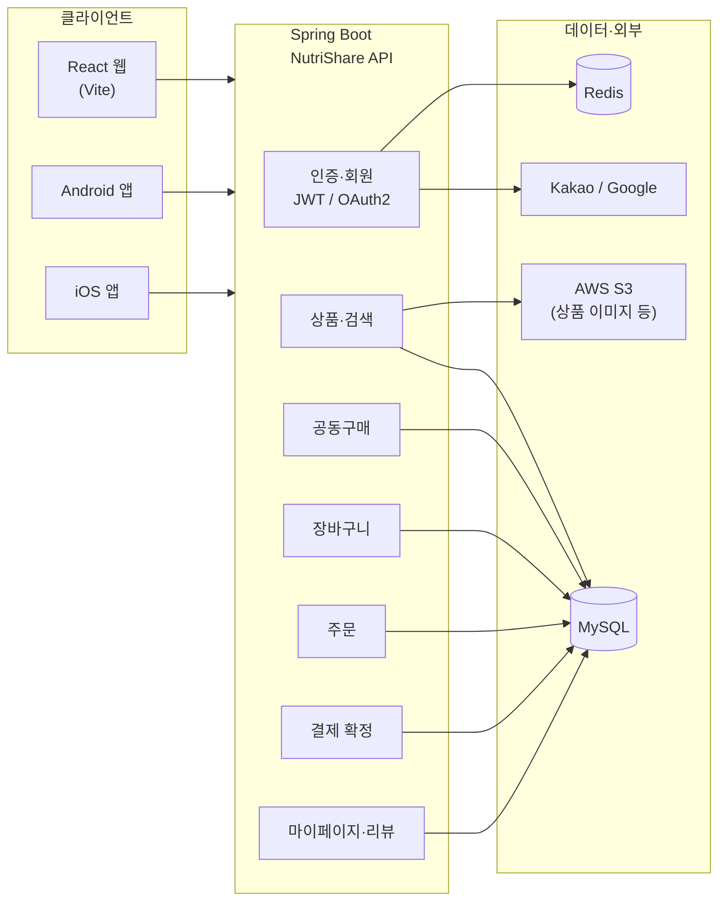

<div align="center">

# 📚 NutriShare - 공동구매 쇼핑몰 프로젝트

</div>

## 📖 목차

- [🎯 프로젝트 소개](#-프로젝트-소개)
- [🏠 홈페이지](#-홈페이지)
- [📌 기능 구성도](#-기능-구성도)
- [📌 API 명세서](#-api-명세서)
- [💻 코드](#-코드)
- [📱 App 설치](#-app-설치)
- [🎬 시연 동영상](#-시연-동영상)
- [🏆 작년 우수팀과의 비교표](#-작년-우수팀과의-비교표)
- [👥 팀원 소개](#-팀원-소개)

---

## 🎯 프로젝트 소개

NutriShare는 생필품 등 상품을 **공동구매**로 모집하고, **장바구니·주문·결제·마이페이지**까지 이어지는 흐름을 제공하는 쇼핑/공구 서비스입니다.  
웹(React)과 모바일 앱이 동일한 백엔드 API(`/api/v1`)를 사용하는 구조입니다.

### 핵심 기능

- 공동구매 모집·참여·목록/상세 조회
- 장바구니 담기 및 주문/결제 시스템 (시뮬레이션 결제 플로우)
- 공동구매 참여 기준 리뷰 작성 및 조회
- JWT 기반 사용자 인증 (액세스 토큰 + 리프레시 재발급), 카카오·구글 OAuth 로그인
- 관리자 물품 등록/삭제 및 이미지 관리 (AWS S3)
- **Android, iOS, 데스크탑(웹)** 에서 이용 가능한 크로스플랫폼 구성

---

## 🏠 홈페이지

| 구분 | URL / 설명 |
|------|------------|
 | **웹(React) 배포** | https://react-navy-xi.vercel.app/ |
| **앱** | [Android](#) \| [iOS TestFlight](#) |

---

## 📌 기능 구성도
<details>
 <summary>🔍 펼치기</summary>
 
### 시스템 관점




### 사용자 기능 흐름

```
회원가입/로그인 (OAuth 또는 개발자 로그인)
    ↓
상품 목록·검색·상세
    ↓
구매 방식 선택
    ├── 장바구니
    └── 공동구매 모집·참여
    ↓
체크아웃 · 주문 생성
    ↓
결제 확정 API
    ↓
마이페이지 (주문·참여·리뷰)
```

</details>
---

## 📌 API 명세서
<details>
 <summary>🔍 펼치기</summary>
 
### 공통

| 항목 | 내용 |
|------|------|
| **Base URL** | `http://3.36.139.67/api/v1` |
| **인증** | `Authorization: Bearer {accessToken}` |
| **응답** | 보통 `data` 필드에 실제 페이로드 |
| **쿠키** | `withCredentials: true` (토큰 재발급 등) |

### 인증·토큰

| 메서드 | 경로 | 설명 |
|--------|------|------|
| GET | `/auth/dev-login` | 개발용 즉시 로그인 |
| POST | `/auth/reissue` | 액세스 토큰 재발급 |

### 사용자·프로필

| 메서드 | 경로 | 설명 |
|--------|------|------|
| GET | `/users/me` | 내 프로필 |
| PUT | `/users/me` | 프로필·주소 수정 |
| GET | `/users/me/orders` | 내 주문 |
| GET | `/users/me/participations` | 내 공구 참여 |
| POST | `/users/me/reviews` | 리뷰 작성 |

### 상품

| 메서드 | 경로 | 쿼리/비고 |
|--------|------|-----------|
| GET | `/products` | `size` 등 |
| GET | `/products/search` | `q`, `size` |
| GET | `/products/{id}` | 상세 |

### 장바구니

| 메서드 | 경로 | 비고 |
|--------|------|------|
| GET | `/cart` | 조회 |
| POST | `/cart` | `productId`, `quantity` |
| PUT | `/cart/{productId}` | `quantity` |
| DELETE | `/cart/{productId}` | 삭제 |

### 공동구매

| 메서드 | 경로 | 비고 |
|--------|------|------|
| GET | `/groups` | `size` 등 |
| GET | `/groups/{id}` | 상세 |
| POST | `/groups` | 모집 생성 |
| POST | `/groups/{id}/join` | 참여 |

### 주문·결제

| 메서드 | 경로 | 비고 |
|--------|------|------|
| POST | `/orders` | 주문 생성 |
| POST | `/payments/confirm` | 결제 확정 |

> 관리자·S3 등 웹에서 호출하지 않는 API는 백엔드 저장소·Swagger 기준으로 확인.
</details>

---

## 💻 코드

| 저장소 | 링크 |
|--------|------|
| 백엔드 | [Backend](https://github.com/26-1-Capstone/Spring) |
| 리액트(웹) | [web](https://github.com/26-1-Capstone/React) |
| Android | [android](https://github.com/26-1-Capstone/Android) |
| iOS | [mobile](https://github.com/26-1-Capstone/IOS) |

---

## 📱 App 설치

| 플랫폼 | 링크 |
|--------|------|
| Android | APK / 스토어 링크 입력 |
| iOS | TestFlight |

---

## 🎬 시연 동영상

- 📹 안드로이드 시연 영상 (https://youtube.com/shorts/nsMjESt-zVo)
- [📹 아이폰 시연 영상] (https://youtu.be/Mm-R8tdzca0)
- 📹 리액트(PC) 시연 영상 (https://www.youtube.com/watch?v=_P4TziFBocU))

---

## 🏆 작년 우수팀과의 비교표

| 항목 | NutriShare | 최우수 | 우수1 | 우수2 | 우수3 |
|------|:---------:|:------:|:-----:|:-----:|:-----:|
| Code | ✅ | ✅ | ✅ | ✅ | ✅ |
| Doc | ✅ | ✅ | ✅ | ❌ | ✅ |
| 영상 | ✅ | ✅ | ✅ | ❌ | ✅ |
| 화면 | W, A, I | R | R | R | R |
| AppStore/GooglePlay | ✅ | ❌ | ❌ | ❌ | ❌ |

- **최우수:** 황치즈 — https://github.com/HwangCheese/VideoSummary
- **우수1:** 황금토끼 — https://github.com/GolddBunny/Domain_QA_Gen
- **우수2:** 초신성 — https://github.com/kola0709/2025Capstone/tree/master *(작품설명 없음)*
- **우수3:** Prism — https://github.com/hsu-capstone-prism/DamSeol

---

## 👥 팀원 소개

| 역할 | 이름 | GitHub |
|------|------|--------|
| 백엔드 | 김준호 | [GitHub](https://github.com/kjhh2605) |
| 웹 프론트엔드 | 박성훈 | [GitHub](https://github.com/parkseonghun598) |
| Android | 신한석 | [GitHub](https://github.com/0Whitebird0) |
| iOS | 최용주 | [GitHub](https://github.com/YJEND) |

---

<div align="center">

Copyright © 2026 NutriShare. All rights reserved.

</div>
